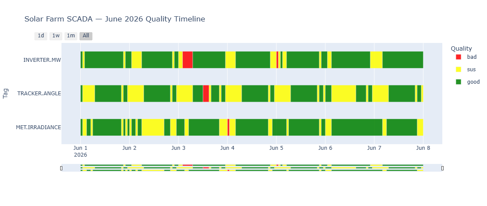

# timeseries-qc

[](https://pypi.org/project/timeseries-qc/)
[](LICENSE)

**The open source data quality-control layer for SCADA, DCS, IoT, and historian timeseries data.**

Add `good / sus / bad` quality labels to every row of a pandas DataFrame in five lines. Then render a multi-tag horizontal status timeline, the chart that no other open-source library produces.

A simple to digest and understand timeseries data quality check. Catch the issues in your process data before it affects your downstream analytics and business decisions. Build data quality checks based on business rules and monitor through interactive graph  components. 

**Sample Input - Solar farm SCADA data:**

```text
| timestamp                 | tag_name       | value   |
| :------------------------ | :------------- | :------ |
| 2026-01-01 00:00:00+00:00 | INVERTER.MW    | 42.1    |
| 2026-01-01 01:00:00+00:00 | INVERTER.MW    | NULL    |  <-- timeseries_qc will catch this (Null value)
| 2026-01-01 02:00:00+00:00 | INVERTER.MW    | 52.3    |
| 2026-01-01 00:00:00+00:00 | MET.IRRADIANCE | 600.001 |
| 2026-01-01 01:00:00+00:00 | MET.IRRADIANCE | 600.001 |  <-- timeseries_qc will catch this (Stale/Frozen value)
| 2026-01-01 02:00:00+00:00 | MET.IRRADIANCE | 810.818 |
| 2026-01-01 00:00:00+00:00 | TRACKER.ANGLE  | 30.22   |
| 2026-01-01 01:00:00+00:00 | TRACKER.ANGLE  | 45.31   |
| 2026-01-01 02:00:00+00:00 | TRACKER.ANGLE  | 60.22   |
```

**Sample Output - Solar farm SCADA data:**




**Sample Input - Oil field SCADA data:**

```text
| timestamp                 | tag_name     | value  |
| :------------------------ | :----------- | :----- |
| 2026-01-01 00:00:00+00:00 | WHP.PSIG     | 0      |  <-- timeseries_qc will catch this (Flatline/Zero)
| 2026-01-01 01:00:00+00:00 | WHP.PSIG     | 0      |  <-- timeseries_qc will catch this (Flatline/Zero)
| 2026-01-01 02:00:00+00:00 | WHP.PSIG     | 0      |  <-- timeseries_qc will catch this (Flatline/Zero)
| 2026-01-01 00:00:00+00:00 | FMRATE.MSCFD | 12.1   |
| 2026-01-01 01:00:00+00:00 | FMRATE.MSCFD | 90.99  |  <-- timeseries_qc will catch this (Rate-of-change spike)
| 2026-01-01 02:00:00+00:00 | FMRATE.MSCFD | 12.3   |
| 2026-01-01 00:00:00+00:00 | OHT.TEMP_F   | 30.2   |
| 2026-01-01 01:00:00+00:00 | OHT.TEMP_F   | 45.2   |
| 2026-01-01 02:00:00+00:00 | OHT.TEMP_F   | 6000.2 |  <-- timeseries_qc will catch this (Out of bounds)
```

**Sample Output - Oil field SCADA data:**


## Features

- **Four built-in rules** cover ≥80% of real-world bad data: `NullRule`, `FlatlineRule`, `DeltaRule`, `RangeRule`
- **Timeline chart** (`result.plot()`) — Plotly Gantt-style, one row per tag, Green/Yellow/Red, hover tooltips
- **YAML config** — non-coders set thresholds in a text file, no Python required
- **Timestamp health** (`result.check_timestamps()`) — detects gaps, duplicates, non-monotonic, freq drift, DST ambiguity
- **Self-contained HTML export** (`result.export_report("report.html")`) — offline, no CDN, includes per-issue summary table
- **Per-issue breakdown** (`result.issue_summary()`) — start/end times, row count, duration, and status for each contiguous bad/sus segment
- **Pandas-native** — works with any DataFrame that has `timestamp`, `tag_name`, `value` columns

---

## Installation

```bash
pip install timeseries-qc
```

---

## Quickstart (5 lines)

```python
import tsqc
import pandas as pd

df = pd.read_csv("sensor_data.csv")          # columns: timestamp, tag_name, value
result = tsqc.check(df, assume_tz="UTC")     # assume_tz required for tz-naive CSVs
result.plot().show()                          # renders the multi-tag quality timeline
```

If your CSV already contains tz-aware timestamps (ISO 8601 with `+00:00`), omit `assume_tz`.

---

## YAML Config Example

```yaml
# tsqc_rules.yaml
default_rules:
  - check: null
    level: bad
  - check: flatline
    window: 1h
    min_delta: 0.001
    level: sus
  - check: delta
    threshold: 50.0
    level: sus

tag_rules:
  FOREBAY.LEVEL:
    - check: range
      min: 900
      max: 1100
      level: bad
  "GENERATOR.*":
    - check: range
      min: 0
      max: 200
      level: bad
    - check: flatline
      window: 30min
      min_delta: 0.5   # 0 MW for <30min is valid; longer flatline at non-zero is suspect
      level: sus
```

```python
result = tsqc.check(df, rules="tsqc_rules.yaml")
result.summary()           # DataFrame: pct_good/sus/bad per tag
result.issue_summary()     # DataFrame: per-issue runs (start, end, rows, duration)
result.check_timestamps()  # DataFrame: gap/duplicate/non_monotonic issues
result.export_report("report.html")  # Full HTML with chart + all tables
```

---

## Output Schema

`result.df` adds two columns to your DataFrame:

| Column | Values | Notes |
|--------|--------|-------|
| `quality` | `"good"`, `"sus"`, `"bad"` | Worst-level rule wins |
| `quality_reasons` | e.g. `"flatline\|range"` | Pipe-delimited triggered rule names |

---

## Comparison with Alternatives

**Pecos** (Sandia Labs) offers binary pass/fail and has been in maintenance mode since 2021 — no timeline chart and no YAML config. **SaQC** (Helmholtz UFZ) is a rich flagging engine for environmental science but has an environmental-domain API, no timeline visualization, and an LGPL license. **Great Expectations** is not timeseries-native and produces no visualization. `timeseries-qc` is the only library that combines (1) Good/Sus/Bad classification, (2) the multi-tag horizontal status timeline, and (3) YAML-driven configuration in a single `pip install`.

---

## Examples

- [examples/solar_farm.ipynb](examples/solar_farm.ipynb) — solar farm SCADA data with anomaly injection
- [examples/oilfield.ipynb](examples/oilfield.ipynb) — oil well pad SCADA data with anomaly injection

---

## Known Limitations (v0.1.0)

1. **Pandas only.** PySpark and Polars support are deferred.
2. **No YAML override of default rules.** Tag-specific rules add to, not replace, default rules.
3. **Visualization requires Plotly ≥ 5.0.** Matplotlib output not supported.
4. **`DeltaRule` is point-to-point diff only.** Rolling-window delta is a v0.2 feature.

---

## License

MIT © timeseries-qc contributors
