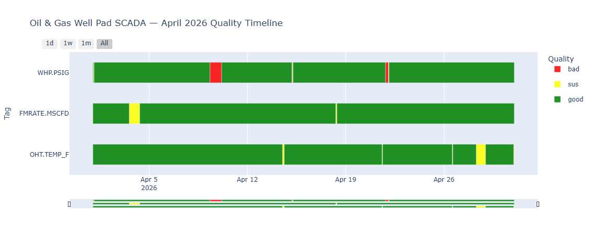

<div class="tsqc-hero" markdown="1">

# **timeseries**-qc

**The open source data quality-control layer for SCADA, DCS, IoT, and historian time-series data.**

Add **good / suspect / bad** quality labels to every row of a pandas DataFrame in five lines.
Then render a multi-tag horizontal status timeline — the chart that no other open-source library produces.

<div class="badges" markdown="1">
[](https://pypi.org/project/timeseries-qc/)
[](https://pypi.org/project/timeseries-qc/)
[](https://github.com/nagusubra/timeseries-qc/blob/main/LICENSE)
[](https://github.com/nagusubra/timeseries-qc)
</div>

<div class="tsqc-install">
  <span class="prompt">$</span>
  <span>pip install timeseries-qc</span>
</div>

</div>

---

## Quickstart

```python
import tsqc
import pandas as pd

df = pd.read_csv("sensor_data.csv")          # columns: timestamp, tag_name, value
result = tsqc.check(df, assume_tz="UTC")     # assume_tz required for tz-naive CSVs
result.plot().show()                          # renders the multi-tag quality timeline
```

That's the entire API. `check()` returns a `QCResult` with all downstream methods.

[Get Started &rarr;](quickstart.md){ .md-button .md-button--primary }
[Installation Guide &rarr;](installation.md){ .md-button }
[View on GitHub &rarr;](https://github.com/nagusubra/timeseries-qc){ .md-button }

---

## Features

<div class="tsqc-grid" markdown="1">
<div class="tsqc-grid-item" markdown="1">
**Built-in Rules**

Null, Flatline, Delta, and Range rules cover the majority of real-world sensor faults. Custom rules accept any callable.
</div>
<div class="tsqc-grid-item" markdown="1">
**Timeline Chart**

Plotly horizontal Gantt chart with one row per tag, color-coded by quality, interactive hover, and range selector.
</div>
<div class="tsqc-grid-item" markdown="1">
**YAML Configuration**

Write rules in a plain text file. No Python required. Glob patterns supported for tag matching.
</div>
<div class="tsqc-grid-item" markdown="1">
**Timestamp Health**

Detects gaps, duplicates, non-monotonic timestamps, frequency drift, and DST ambiguities.
</div>
<div class="tsqc-grid-item" markdown="1">
**Offline HTML Report**

Self-contained export with embedded Plotly chart, summary tables, and per-issue breakdown. No CDN needed.
</div>
<div class="tsqc-grid-item" markdown="1">
**Pandas Native**

Works with any DataFrame containing timestamp, tag_name, and value columns. Single-tag mode supported.
</div>
</div>

### Quality Labels

<div class="tsqc-qlabels" markdown="1">
<span class="tsqc-qlabel good">&#9679; good</span>
<span class="tsqc-qlabel suspect">&#9679; suspect</span>
<span class="tsqc-qlabel bad">&#9679; bad</span>
</div>

When multiple rules fire, the worst level wins: **bad > sus > good**. Triggered rule names appear in a pipe-delimited `quality_reasons` column.

---

## Example Output

<figure class="tsqc-screenshot" markdown="1">

<figcaption>Solar farm — 3 tags, 1 week of hourly data. NaN bursts, flatlines, out-of-range values, and delta spikes flagged by all four rules.</figcaption>
</figure>

<figure class="tsqc-screenshot" markdown="1">

<figcaption>Oil well pad — 3 tags, 1 month of hourly data. Pressure, flow, and temperature anomalies detected and classified.</figcaption>
</figure>

---

## Input & Output

### Input

| Column | Type | Notes |
|--------|------|-------|
| `timestamp` | datetime | UTC-aware or tz-naive (pass `assume_tz`) |
| `tag_name` | str | Sensor identifier. Omit column or pass `tag_col=None` for single-tag mode. |
| `value` | float | The measurement to check. |

### Output

`result.df` adds two columns to the original DataFrame:

| Column | Values | Notes |
|--------|--------|-------|
| `quality` | `"good"`, `"sus"`, `"bad"` | Worst-level rule wins |
| `quality_reasons` | e.g. `"flatline\|range"` | Pipe-delimited triggered rule names |

---

## YAML Config

```yaml
# tsqc_rules.yaml
default_rules:
  - check: null
    level: bad
  - check: flatline
    window: 1h
    min_delta: 0.001
    level: sus
  - check: delta
    threshold: 50.0
    level: sus

tag_rules:
  "FOREBAY.LEVEL":
    - check: range
      min: 900
      max: 1100
      level: bad
  "GENERATOR.*":
    - check: range
      min: 0
      max: 200
      level: bad
    - check: flatline
      window: 30min
      min_delta: 0.5
      level: sus
```

```python
result = tsqc.check(df, rules="tsqc_rules.yaml")
result.summary()           # DataFrame: pct_good/sus/bad per tag
result.issue_summary()     # DataFrame: per-issue runs (start, end, rows, duration)
result.check_timestamps()  # DataFrame: gap/duplicate/non_monotonic issues
result.export_report("report.html")  # Full HTML with chart + all tables
```

---

## Comparison with Alternatives

| | timeseries-qc | Pecos | SaQC | Great Expectations |
|---|---|---|---|---|
| Classification | Good / Sus / Bad | Pass / Fail | Flags | Pass / Fail |
| Timeline chart | Yes | No | No | No |
| YAML config | Yes | No | JSON | No |
| Time-series native | Yes | Yes | Yes | No |
| License | MIT | BSD-3 | LGPL | Apache-2.0 |

**Pecos** (Sandia Labs) offers binary pass/fail and has been in maintenance mode since 2021 — no timeline chart and no YAML config.

**SaQC** (Helmholtz UFZ) is a rich flagging engine for environmental science but has an environmental-domain API, no timeline visualization, and an LGPL license.

**Great Expectations** is not timeseries-native and produces no visualization.

`timeseries-qc` is the only library that combines (1) Good/Sus/Bad classification, (2) the multi-tag horizontal status timeline, and (3) YAML-driven configuration in a single `pip install`.

---

## Known Limitations (v0.1.1)

1. **Pandas only.** PySpark and Polars support are planned.
2. **No YAML override of default rules.** Tag-specific rules add to, not replace, default rules.
3. **Visualization requires Plotly ≥ 5.0.** Matplotlib output is not yet supported.
4. **`DeltaRule` is point-to-point diff only.** Rolling-window delta is planned for v0.2.

[View Roadmap &rarr;](roadmap.md)

---

## Next Steps

<div class="tsqc-grid" markdown="1">
<div class="tsqc-grid-item" markdown="1">
**[Installation Guide](installation.md)**

System requirements, pip install, and dev setup.
</div>
<div class="tsqc-grid-item" markdown="1">
**[Quickstart](quickstart.md)**

Run your first quality check in 5 lines.
</div>
<div class="tsqc-grid-item" markdown="1">
**[API Reference](api-reference.md)**

Full documentation for every function and method.
</div>
<div class="tsqc-grid-item" markdown="1">
**[GitHub](https://github.com/nagusubra/timeseries-qc)**

Source code, issues, and contributions.
</div>
</div>
